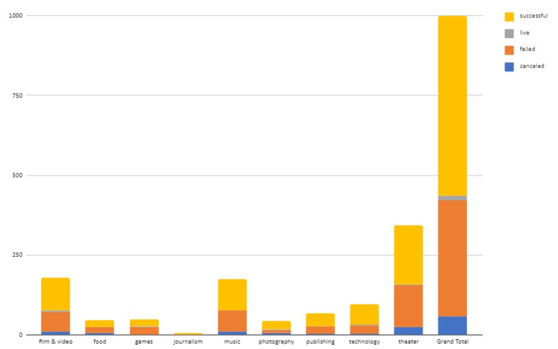
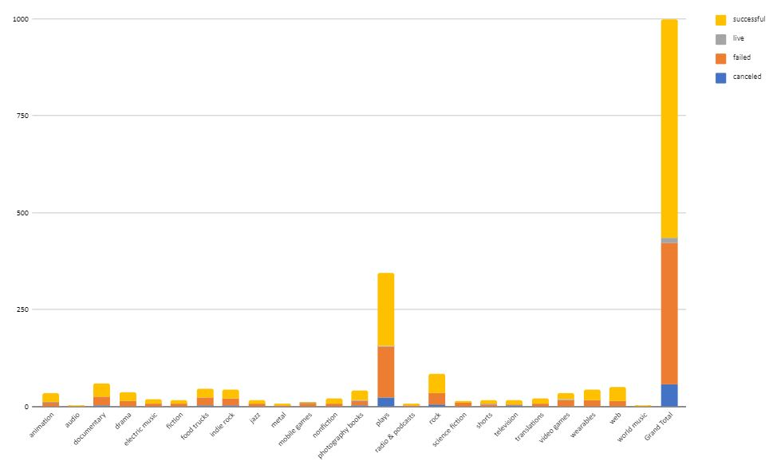
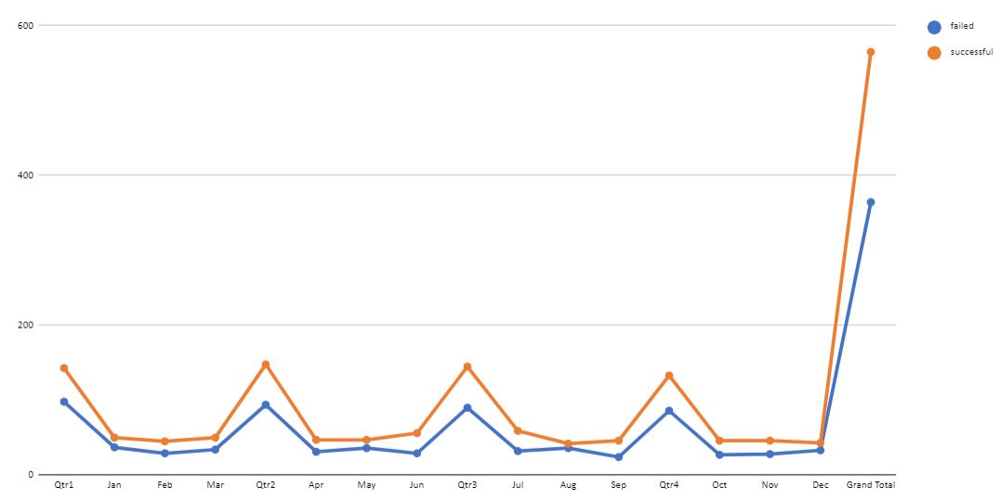
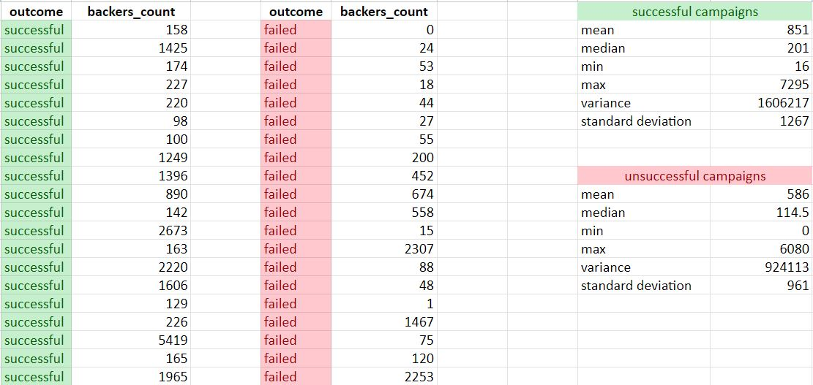

# Unveiling-Kickstarter-Trends-An-Excel-Data-Analysis

## Introduction
Diving into 4,000 past Kickstarter projects, I aim to unveil trends and patterns. Using Excel, I analyse data, visualise outcomes, calculate success rates, and dissect categories. Insights about funding, donations, and timing emerge. Statistical analysis enriches understanding. Let's embark on this data journey."

## Source of Data
Within the Resources folder:
* CrowdfundingBook.xlsx

## Findings

## Conclusion
